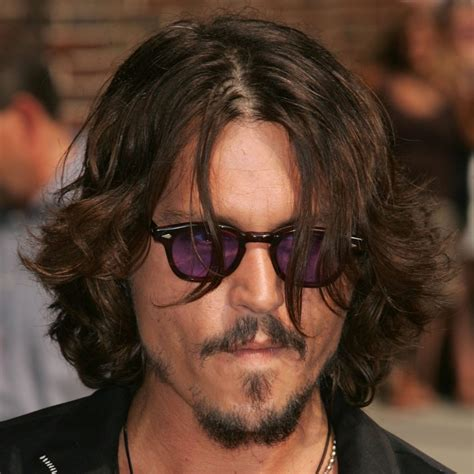
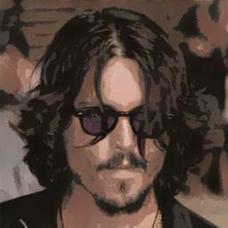

# Pix2Pix Cartooniser: Real to Cartoon Image Translation

This project implements a **Pix2Pix Conditional GAN (cGAN)** to translate real images into cartoon-style images. The model is trained using paired data of real and cartoon images, following the architecture described in the original Pix2Pix paper.

The project includes:
- **Training**: Train a Pix2Pix model with your own paired dataset (real vs. cartoon images).
- **Inference**: Apply the trained model to new real images to generate cartoon-style outputs.
- **Validation**: Test the trained model on unseen data to evaluate its performance.

---

## 📁 Folder Structure

```plaintext
pix2pix-cartooniser/
├── data/
│   ├── train/
│   │   ├── real/       # Real training images (e.g., photo.jpg)
│   │   └── cartoon/    # Matching cartoon images (e.g., photo.jpg)
│   ├── test/
│   │   ├── real/       # Real testing images
│   │   └── cartoon/    # Matching cartoon testing images
├── checkpoints/        # Saved models during training (e.g., generator_last.pt)
├── new_real_images/    # New real images for inference
├── results/            # Output cartoonised images from inference
├── models/             # Generator and Discriminator code
├── dataset.py          # Dataset loader for paired images
├── train.py            # Training script
├── inference.py        # Inference script
├── requirements.txt    # Python dependencies
└── README.md           # Project documentation
```

---

## 🛠 Requirements

1. **Python**: 3.7 or newer  
2. **PyTorch**: Compatible with your CUDA/CPU setup.  
3. **Dependencies**: Install them with:

```bash
pip install -r requirements.txt
```

---

## 🚀 Getting Started

### 1. Prepare Your Dataset

Organise your dataset in the following structure:
```plaintext
data/
├── train/
│   ├── real/       # Real training images
│   └── cartoon/    # Matching cartoon images
├── test/
│   ├── real/       # Real testing images
│   └── cartoon/    # Matching cartoon testing images
```

Each real image in `train/real/` should have a corresponding cartoon image in `train/cartoon/` with the **same filename** (e.g., `photo001.jpg` in both).


#### **Need Help Preparing Your Dataset?**

You can use the **data preparation tool** from this repository:  
[https://github.com/Marc-Habib/cartooniser](https://github.com/Marc-Habib/cartooniser)

---

### 2. Train the Model

Run the training script to train the Pix2Pix model:

```bash
python train.py --data_root data --epochs 100 --batch_size 1 --save_interval 10
```

- **Arguments**:
  - `--data_root`: Path to the dataset directory (default: `data`).
  - `--epochs`: Number of training epochs (default: 100).
  - `--batch_size`: Batch size (default: 1 for Pix2Pix).
  - `--save_interval`: Save model checkpoints every N epochs (default: 10).

**Output**:
- Checkpoints (e.g., `generator_last.pt`) are saved in the `checkpoints/` folder.

---

### 3. Test the Model

After training, test the model on unseen images from the `test/real/` directory:

```bash
python inference.py --generator_path checkpoints/generator_last.pt --input_dir data/test/real --output_dir results
```

- **Arguments**:
  - `--generator_path`: Path to the trained generator model (default: `checkpoints/generator_last.pt`).
  - `--input_dir`: Folder containing real images to cartoonise.
  - `--output_dir`: Folder to save the cartoonised images.

---

### 4. Cartoonise New Images

To generate cartoons for new real images:
1. Place your real images in the `new_real_images/` folder.
2. Run the inference script:

```bash
python inference.py --generator_path checkpoints/generator_last.pt --input_dir new_real_images --output_dir results
```

**Output**: Cartoonised images are saved in the `results/` folder.

---

## 📊 Results

Here’s an example of the Pix2Pix GAN’s output:

| **Input (Real Image)** | **Output (Cartoonised Image)** |
|-------------------------|-------------------------------|
|  |  |


---

## 🧠 How It Works

1. **Generator (U-Net)**:
   - Translates real images into cartoon-style images using an encoder-decoder architecture with skip connections.

2. **Discriminator (PatchGAN)**:
   - Evaluates whether an image pair (real + cartoon) is real or fake at a patch level.

3. **Loss Functions**:
   - **Adversarial Loss**: Encourages the generator to produce realistic cartoons.
   - **L1 Loss**: Ensures pixel-level similarity between the generated and ground-truth cartoon images.

---

## 🔧 Adjustments and Extensions

- **Different Datasets**: Use this framework for other paired datasets like image-to-sketch translation.
- **Custom Architectures**: Experiment with alternative GAN architectures like CycleGAN.

---

## 📝 Notes

- Ensure that your dataset is properly aligned (real and cartoon images must have matching filenames).
- Train with more epochs for better results (e.g., 200+ epochs on a large dataset).

---
